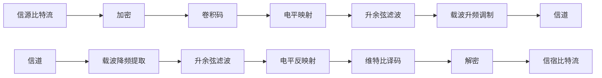

# README

Project2 **安全编码与波形信道传输**

- [README](#readme)
  - [波形信道传输模型](#波形信道传输模型)
  - [波形信道传输](#波形信道传输)
  - [安全编码](#安全编码)

## 波形信道传输模型

通网课件 `3 数字调制与传输` `p49`

预计流程图如下（相比于大作业I，在收发端增加了一个加解密模块和一个载波调制模块）

## 波形信道传输

**在第二次仿真任务基础上，考虑以下波形信道**：
* 某数据传输系统，试图利用 300-3400Hz 的双边话音通道进行载波传输，波形信道为加性高斯白噪声信道。
  * $W = \frac{3400-300}{2} = 1550\ \text{Hz}$
  * 进行基带调制后，时域乘 $\cos(2 \pi f_0 t)$ 升频。其中 $f_0 = \frac{3400+300}{2}\ \text{Hz} = 1850\ \text{Hz}$
* 采用线性传输，收发两端拟采用滚降系数 $0.5$ 的根号升余弦滤波，以解决采样点失真问题。
  * 在 MATLAB 中使用 `rcosdesign()` 得到根号升余弦滤波器
  * $\alpha = 2 W T_s - 1 = 0.5$ 可以得到 $T_s = \frac{\alpha + 1}{2W}$
  * $R_S = \frac{1}{T_s} \leq \frac{2W}{1 + \alpha} = 2067\ \text{符号/s}$，所需传输速度为 $R_b \geq \frac{8192\ \text{bit}}{5\ \text{s}} = 1638\ \text{bit/s}$。
  * 当然实际传输不一定占满所给频带 可以降低$W$的值（但会导致$R_s$下降）

**需求**：
* 某数据文件大小为 1 kB，希望在5秒钟之内传完 (不是说5秒钟内仿真完，而是说相当于以信道中传输的波形的时间长度不超过5秒)。
  * 即希望 5 s 传输 8192 bit
  * $R_S \leq 2067\ \text{符号/s}$, $R_b \geq 1638\ \text{bit/s}$，故可以使用二元符号映射方式。
  * 加入编码等冗余后需要注意不超过此限制

**任务**：
* 无编码情况下，自行选择调制方式和参数(进制数、符号率)，说明理由
  * `MASK` `MPSK`
  * 符号率选择$R_s = \frac{1}{T_s}$ 当然也可以选用更低的符号速率 占用更少的带宽
* 自行选择合适的采样率刻画信号波形，画出发射波形(细节)和功率谱
  * 采样率选择符号速率的`precision_N`倍
* 按该采样率产生一定功率谱密度 $n_0$ 的AWGN，叠加在一定功率的调制信号上，作为接收机输入，画出叠加噪声的接收信号波形(细节)和功率谱
  * 使用MATLAB的`awgn()`函数添加噪声 设定信噪比为`SNR`
* 编写解调判决模块，统计误比特率与 $E_b/n_0$ 的关系
* 引入卷积码，自行选择编码参数(效率)和调制参数，说明理由
* 编写相应的信道编码(含调制)，画出发射波形(细节)和功率谱，接收机入口信号波形和功率谱
* 编写相应的接收机，完成从接收波形到最终信源比特的恢复，统计硬判决和软判决的误比特率与 $E_b/n_0$ 的关系(注意 $E_b$ 是平均传输每个信源比特所需要的接收信号分量的能量)

## 安全编码

**设计一种加密机制(繁简自便，但要有明确的算法说明)**:
* 完成三个模块: **加密模块**、**解密模块**、**密钥生成模块**
* 加密模块的输入为明文文件、加密密钥，输出为密文文件
* 解密模块的输入为密文文件、解密密钥，输出为明文文件
* 要求不同密钥个数不小于100个。供使用者选取

**安全、信道编码联调**:
* 无加密:观察不同信噪比条件下，误码图案
* 有加密:观察不同信噪比条件下，误码图案