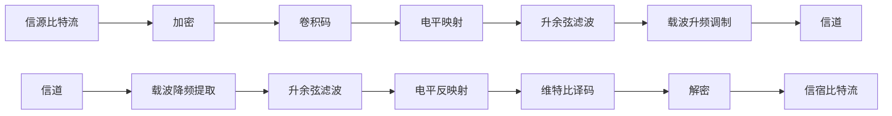

# README

Project2 **安全编码与波形信道传输**

## 波形信道传输模型

通网课件 `3 数字调制与传输` `p49`

预计流程图如下（相比于大作业I，在收发端增加了一个加解密模块和一个载波调制模块）

## 波形信道传输

**在第二次仿真任务基础上，考虑以下波形信道**：
* 某数据传输系统，试图利用 300-3400Hz 的双边话音通道进行载波传输，波形信道为加性高斯白噪声信道。
  * $W = \frac{3400-300}{2} = 1550 Hz$
  * 进行基带调制后，时域乘 $\cos(2 \pi f_0 t)$ 升频。其中 $f_0 = \frac{3400+300}{2}\text{Hz} = 1850\text{Hz}$
* 采用线性传输，收发两端拟采用滚降系数 $0.5$ 的根号升余弦滤波，以解决采样点失真问题。
  * 升余弦频域表达式用分段函数即可写出，在 MATLAB 中使用 `sqrt()` 得到根号升余弦滤波器的频域表达式
  * $\alpha = 2 W T_s - 1 = 0.5$ 可以得到 $T_s = \frac{\alpha + 1}{2W}$
  * $R_S = \frac{1}{T_s} \leq \frac{2W}{1 + \alpha} = 2067 \text{Hz}$，所需传输速度为 $R_b \geq \frac{8192bit}{5s} = 1638 Hz$，故可使用二元调制方式。
  * 当然实际传输不一定占满所给频带 可以降低$W$的值（但会导致$R_s$下降）

**需求**：
* 某数据文件大小为1kB，希望在5秒钟之内传完(不是说5秒钟内仿真完，而是说相当于以信道中传输的波形的时间长度不超过5秒)。
  * 即希望$5 s$传输$8192 bit$
  * 而实际信道的$1/T_s$最高约为$2066符号/s$ 可以传输比特 但加入编码等冗余后需要注意不超过此限制

**任务**：
* 无编码情况下，自行选择调制方式和参数(进制数、符号率)，说明理由
  * `MASK` `MPSK` `MQAM` `MFSK`
  * 符号率选择$R_s = \frac{1}{T_s}$ 当然也可以选用更低的符号速率 占用更少的带宽
* 自行选择合适的采样率刻画信号波形，画出发射波形(细节)和功率谱
  * 采样率选择符号速率的`precision_N`倍
* 按该采样率产生一定功率谱密度 $n_0$ 的AWGN，叠加在一定功率的调制信号上，作为接收机输入，画出叠加噪声的接收信号波形(细节)和功率谱
  * 使用MATLAB的`awgn()`函数添加噪声 设定信噪比为`SNR`
* 编写解调判决模块，统计误比特率与 $E_b/n_0$ 的关系
* 引入卷积码，自行选择编码参数(效率)和调制参数，说明理由
* 编写相应的信道编码(含调制)，画出发射波形(细节)和功率谱，接收机入口信号波形和功率谱
* 编写相应的接收机，完成从接收波形到最终信源比特的恢复，统计硬判决和软判决的误比特率与 $E_b/n_0$ 的关系(注意 $E_b$ 是平均传输每个信源比特所需要的接收信号分量的能量)

## 安全编码

**设计一种加密机制(繁简自便，但要有明确的算法说明)**:
* RSA算法：

  前置工作:生成两个大素数p与q,这个RSA的加密算法的核心参数就是$N=pq$。其欧拉函数$\phi(N)=(p-1)(q-1)$。再生成公钥与私钥，一个是大于$p,q$且与$\phi(N)$互质的数e，而另一个是满足$de=1(mod\ \phi(N))$的数字。这两个数一个公开一个保密

  在加密段，对明文进行$c=m^e(mod\ N)$的操作得到密文c

  在解密端，对密文进行$m=c^d(mod\ N)$的操作得到明文m

  核心是生成大素数，我们采用Miller-Rabin素性检验解决。

* EIGamal算法：

  前置工作：生成一个大素数p(仍然使用Miller-Rabin素性检验)，找到GF(p)内的一个本原元g**(实际上p是素数的话本原元随便取一个就行)**。然后取2~p-1之间的任意一个数d我作为私钥，计算$y=g^d(mod\ p)$。y也是公钥的一部分。由于循环域内对数操作的难解性，Eve很难从公钥y,g,p中解密出私钥d。

  在加密段：首先生成加密参数k，然后计算$U=y^k=g^{dk}(mod\ p)$。然后生成两个传输的参数。一个是参照项$c_1=g^k(mod\ p)$，第二个是信息项$c_2=(U\times m)(mod\ p)$。(其中m是明文)。$c1,c2$一起被传输

  在解密段，首先利用$c_1$将加密段生成的加密参数k破译：$V=c_1^d=g^{dk}(mod\ p)$。然后取V的逆作为加密操作U的逆操作，解密只需要$m=c_2\times V^{-1}(mod\ p)$

* DES算法：

  算法极其复杂，在此之提供流程图：

  

**安全、信道编码联调**:

* 无加密:观察不同信噪比条件下，误码图案
* 有加密:观察不同信噪比条件下，误码图案