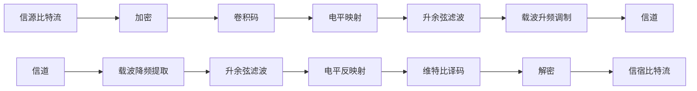
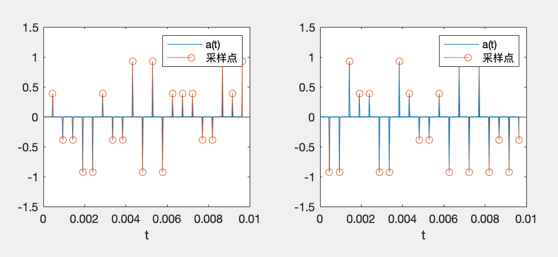
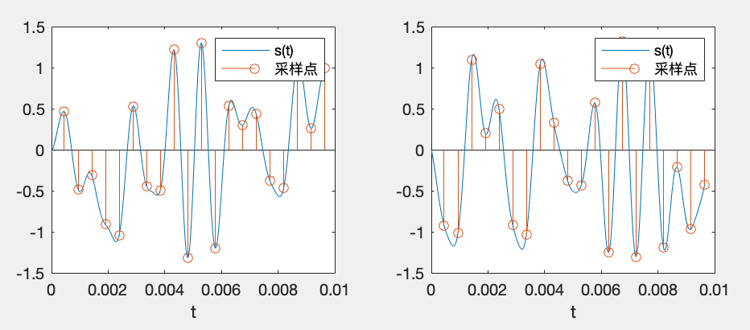
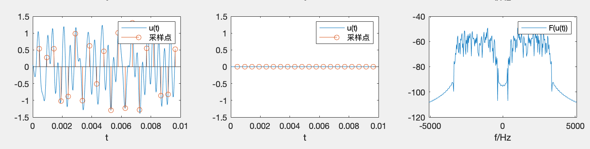
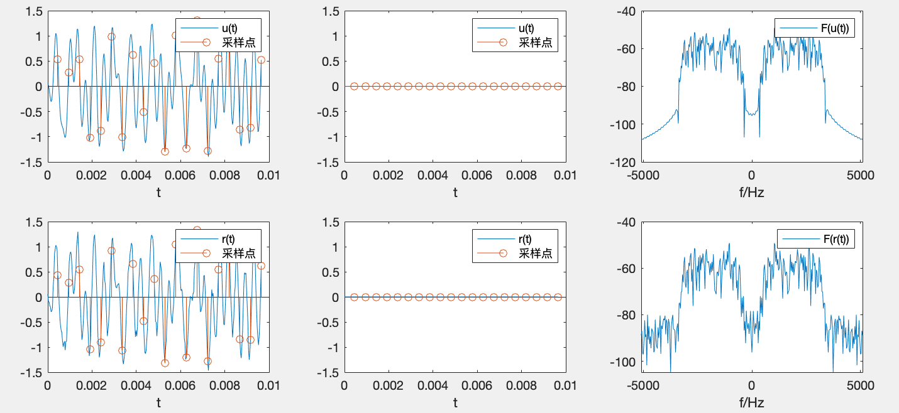
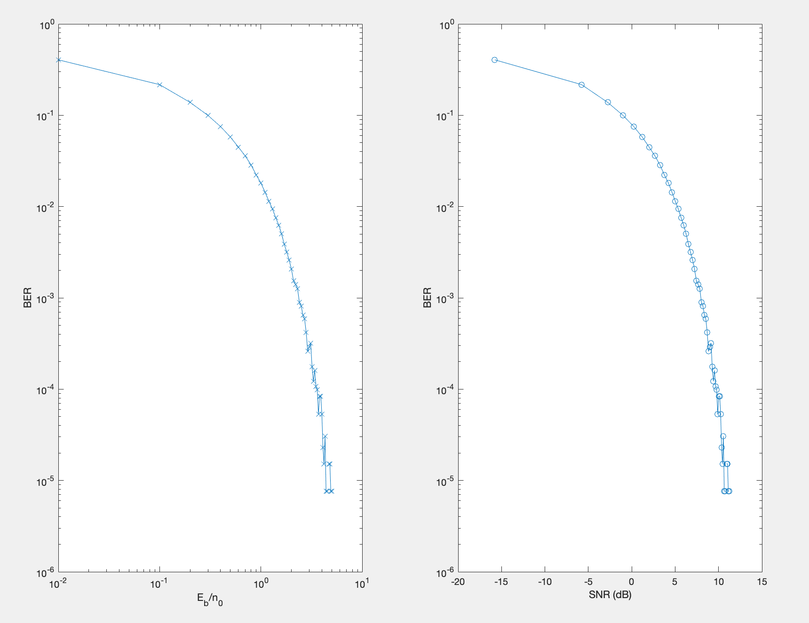

# README

Project2 **安全编码与波形信道传输**

- [README](#readme)
- [0 波形信道传输模型](#0-波形信道传输模型)
- [1 波形信道传输](#1-波形信道传输)
  - [1.1 选择调制方式和参数](#11-选择调制方式和参数)
  - [1.2 选择采样率刻画波形信号](#12-选择采样率刻画波形信号)
  - [1.3 高斯噪声叠加](#13-高斯噪声叠加)
  - [1.4 统计误比特率](#14-统计误比特率)
  - [1.5 卷积码的参数选择](#15-卷积码的参数选择)
  - [1.6 信道编码](#16-信道编码)
  - [1.7 卷积码接收](#17-卷积码接收)
- [2 安全编码](#2-安全编码)

# 0 波形信道传输模型

通网课件 `3 数字调制与传输` `p49`


预计流程图如下（相比于大作业 I，在收发端增加了一个加解密模块和一个载波调制模块）



# 1 波形信道传输

**在第二次仿真任务基础上，考虑以下波形信道**：
* 某数据传输系统，试图利用 300-3400Hz 的双边话音通道进行载波传输，波形信道为加性高斯白噪声信道。
  * $W = \frac{3400-300}{2} = 1550\ \text{Hz}$
  * 进行基带调制后，时域乘 $\cos(2 \pi f_0 t)$ 升频。其中 $f_0 = \frac{3400+300}{2}\ \text{Hz} = 1850\ \text{Hz}$
* 采用线性传输，收发两端拟采用滚降系数 $0.5$ 的根号升余弦滤波，以解决采样点失真问题。
  * 在 MATLAB 中使用 `rcosdesign()` 得到根号升余弦滤波器
  * $\alpha = 2 W T_s - 1 = 0.5$ 可以得到 $T_s = \frac{\alpha + 1}{2W}$
  * $R_S = \frac{1}{T_s} \leq \frac{2W}{1 + \alpha} = 2067\ \text{符号/s}$，所需传输速度为 $R_b \geq \frac{8192\ \text{bit}}{5\ \text{s}} = 1638\ \text{bit/s}$。
  * 当然实际传输不一定占满所给频带 可以降低$W$的值（但会导致$R_s$下降）

**需求**：
* 某数据文件大小为 1 kB，希望在5秒钟之内传完 (不是说5秒钟内仿真完，而是说相当于以信道中传输的波形的时间长度不超过5秒)。
  * 即希望 5 s 传输 8192 bit
  * $R_S \leq 2067\ \text{符号/s}$, $R_b \geq 1638\ \text{bit/s}$，故可以使用二元符号映射方式。
  * 加入编码等冗余后需要注意不超过此限制

**任务**：
* 无编码情况下，自行选择调制方式和参数(进制数、符号率)，说明理由
  * `MASK` `MPSK`
  * 符号率选择$R_s = \frac{1}{T_s}$ 当然也可以选用更低的符号速率 占用更少的带宽
* 自行选择合适的采样率刻画信号波形，画出发射波形(细节)和功率谱
  * 采样率选择符号速率的`precision_N`倍
* 按该采样率产生一定功率谱密度 $n_0$ 的AWGN，叠加在一定功率的调制信号上，作为接收机输入，画出叠加噪声的接收信号波形(细节)和功率谱
  * 使用MATLAB的`awgn()`函数添加噪声 设定信噪比为`SNR`
* 编写解调判决模块，统计误比特率与 $E_b/n_0$ 的关系
* 引入卷积码，自行选择编码参数(效率)和调制参数，说明理由
* 编写相应的信道编码(含调制)，画出发射波形(细节)和功率谱，接收机入口信号波形和功率谱
* 编写相应的接收机，完成从接收波形到最终信源比特的恢复，统计硬判决和软判决的误比特率与 $E_b/n_0$ 的关系(注意 $E_b$ 是平均传输每个信源比特所需要的接收信号分量的能量)

## 1.1 选择调制方式和参数

> 无编码情况下，自行选择调制方式和参数(进制数、符号率)，说明理由

MATLAB代码中实现的调制方式有`MASK`和`MPSK` (M = 2,4,8,16) (`ASK.m` `iASK.m` `PSK.m` `iPSK.m`)，其中`ASK`映射所需的能量较多，但由于不需要考虑复数的处理，实现较为简单；`PSK`所需能量较少，同等发射能量的情况下，`PSK`的误码率理论上比`ASK`更小。

实验中选择**8PSK**作为传输的映射方式，选择的原因是较小的进制数难以达到较高的传输速率，较大的进制数可能会提高出错概率。而且实现代码经修改后支持复数转实数的发射与接收。

```matlab
SK_way = 'PSK';
SK_M = 8;
```

前面已经讨论过，使用二元映射也是满足题设条件的，这里选择最大的传输速率占满频谱，即 $R_S = 2067\ \text{符号/s}$

## 1.2 选择采样率刻画波形信号

> 自行选择合适的采样率刻画信号波形，画出发射波形(细节)和功率谱

采样率选择符号速率的`precision_N`倍，这里在SNR较高时，`precision_N`取3已经足够；当SNR提高时，需要适当提高`precision_N`来提高采样率。

先将随机生成的比特流`message`使用`8PSK`映射为符号；

选取`precision_N = 16`，用冲激串加载符号 刻画“连续”波形得到下图（左侧为实部，右侧为虚部，只取前20个采样点进行示意）：



在此基础上，信号过根号升余弦滤波器得到连续波形：



要发送信号我们需要将低频信号升频:

```matlab
u_t = s_t .* exp(1j * (omega_0 * t));
u_t = real(u_t);
```

`u(t)`即为要发送的连续波形，发射波形(细节)和功率谱如下：



## 1.3 高斯噪声叠加

> 按该采样率产生一定功率谱密度 $n_0$ 的AWGN，叠加在一定功率的调制信号上，作为接收机输入，画出叠加噪声的接收信号波形(细节)和功率谱

使用MATLAB的`awgn()`函数添加噪声 设定信噪比为`SNR = 20`，可以看到频谱上有噪声叠加，波形与未叠加噪声前的波形存在差异。



## 1.4 统计误比特率

> 编写解调判决模块，统计误比特率与 $E_b/n_0$ 的关系

这里首先要导出MATLAB函数`awgn()`的参数`SNR`与 $E_b/n_0$ 的关系：

由于使用`8PSK`，单符号的平均能量为 $E_s = r^2 (r = 1)$，单比特的平均能量 $E_b = \frac{E_s}{3}$，$S = E_b \cdot 8192$

由于传输的信号占满 $300 - 3400 Hz$ 这个频段，$N = n_0 \cdot 3100$

得 $SNR = 10 \lg{\frac{S}{N}} = 10 \lg{\frac{8192E_b}{3100n_0}}$

在`main_noRSA_1_4_analysis.m`中，选取`Ebn0_array = [0.01, 0.1:0.1:5];`，计算出SNR后重复实验多次（`experiment_times`）取平均得到`BER_array`

```matlab
subplot(1, 2, 1);
loglog(Ebn0_array, BER_array, "x-"); xlabel("E_b/n_0"); ylabel("BER");
subplot(1, 2, 2);
semilogy(SNR_array, BER_array, "o-"); xlabel("SNR (dB)"); ylabel("BER");
```

得到如下结果：



- - -

## 1.5 卷积码的参数选择

> 引入卷积码，自行选择编码参数(效率)和调制参数，说明理由

## 1.6 信道编码

> 编写相应的信道编码(含调制)，画出发射波形(细节)和功率谱，接收机入口信号波形和功率谱

## 1.7 卷积码接收

> 编写相应的接收机，完成从接收波形到最终信源比特的恢复，统计硬判决和软判决的误比特率与 $E_b/n_0$ 的关系(注意 $E_b$ 是平均传输每个信源比特所需要的接收信号分量的能量)

# 2 安全编码

**设计一种加密机制(繁简自便，但要有明确的算法说明)**:
* 完成三个模块: **加密模块**、**解密模块**、**密钥生成模块**
* 加密模块的输入为明文文件、加密密钥，输出为密文文件
* 解密模块的输入为密文文件、解密密钥，输出为明文文件
* 要求不同密钥个数不小于100个。供使用者选取

**安全、信道编码联调**:
* 无加密:观察不同信噪比条件下，误码图案
* 有加密:观察不同信噪比条件下，误码图案