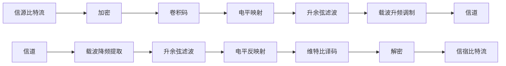

预计流程图如下（相比于大作业I，在收发端增加了一个加解密模块和一个载波调制模块）

```mermaid
graph LR
    Origin[信源比特流]
    Dest[信宿比特流]
    Origin-->加密-->conv[卷积码]-->mapping[电平映射]-->filterT[升余弦滤波]-->modulate[载波升频调制]-->channel1[信道]
    channel2[信道]-->demodulate[载波降频提取]-->filterR[升余弦滤波]-->demapping[电平反映射]-->Viterbi[维特比译码]-->解密-->Dest
```

